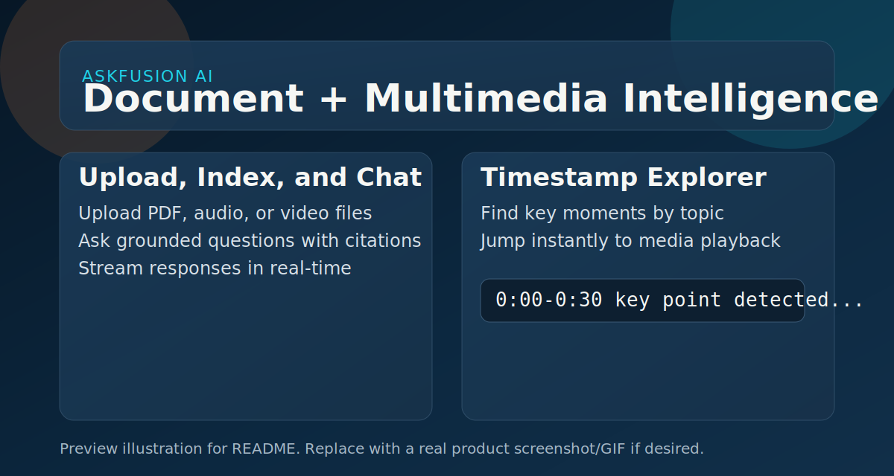

# ASKFUSION AI

[](https://github.com/piyushsinghania23/ASKFUSION-AI/actions/workflows/ci.yml)


ASKFUSION AI is a full-stack app for asking questions from uploaded PDF, audio, and video files.

It is built to be demo-friendly for interviews: upload a file, index it, ask questions, get citations, and jump to relevant media timestamps.

## Demo Snapshot



For live walkthrough: upload a file, ask a question, and click timestamps to jump in media playback.

## Interviewer Quick View

### What Problem It Solves
- Lets users chat with their own documents and media.
- Returns grounded answers from indexed chunks.
- Supports timestamp discovery for audio/video.

### What Is Implemented
- File upload and indexing for PDF, audio, and video.
- Retrieval-based Q&A with citations.
- Summary generation per document.
- Topic-to-timestamp extraction.
- In-app media playback with jump-to-time.
- Streaming answer endpoint (SSE).
- Dockerized stack and CI tests with coverage gate.

### Core Tech
- Frontend: React + TypeScript + Vite
- Backend: FastAPI + SQLAlchemy
- AI: OpenAI APIs with local fallback behavior when key is missing
- Databases: PostgreSQL in Docker, SQLite fallback for local/test
- Infra: Docker Compose + GitHub Actions

## 2-Minute Demo Flow
1. Open `http://localhost:5173`.
2. Upload a PDF or media file.
3. Select the file in Library.
4. Ask a question in Chat and verify citations.
5. Search a topic in Timestamp Explorer.
6. Click a timestamp to jump playback.

## Architecture Snapshot
1. Upload endpoint stores file and creates document metadata.
2. Ingestion service extracts text and chunks it.
3. Embedding service creates vectors for chunks and query.
4. Retrieval ranks relevant chunks.
5. LLM service generates answer from retrieved context.
6. Timestamp extraction surfaces relevant time windows.

## Repository Layout
```text
.
|- backend/
|  |- app/
|  |- tests/
|  |- Dockerfile
|  `- requirements.txt
|- frontend/
|  |- src/
|  |- Dockerfile
|  `- package.json
|- .github/workflows/ci.yml
`- docker-compose.yml
```

## Quick Start (Docker)
1. Optional: set API key.
```powershell
$env:OPENAI_API_KEY="your_key"
```
2. Run containers.
```bash
docker compose up --build
```
3. Open apps.
- Frontend: `http://localhost:5173`
- Backend docs: `http://localhost:8000/docs`

## Deploy on Render
This repo includes a ready Blueprint file: `render.yaml`.

1. Push latest `main` branch to GitHub.
2. In Render Dashboard, click `New` -> `Blueprint`.
3. Connect this repository: `piyushsinghania23/ASKFUSION-AI`.
4. Render detects `render.yaml` and shows resources to create:
- `askfusion-ai-backend` (Web Service, Python)
- `askfusion-ai-frontend` (Static Site)
- `askfusion-ai-db` (Postgres, Free)
5. When prompted, set `ASKFUSION_OPENAI_API_KEY` (optional but recommended).
6. Click `Apply` / `Deploy Blueprint`.
7. After deploy:
- Open frontend URL: `https://askfusion-ai-frontend.onrender.com`
- Backend health: `https://askfusion-ai-backend.onrender.com/health`

Notes:
- Free Render web services spin down on inactivity and may take ~1 minute to wake.
- Free web services use ephemeral local storage, so uploaded files are not permanent.
- CORS for `*.onrender.com` is already configured in backend settings.

## Local Development

### Backend
1. Install dependencies.
```bash
python -m pip install -r backend/requirements.txt
```
2. Run API.
```bash
uvicorn app.main:app --host 0.0.0.0 --port 8000 --app-dir backend
```

### Frontend
1. Install dependencies.
```bash
cd frontend
npm install
```
2. Start dev server.
```bash
npm run dev
```

PowerShell fallback if script policy blocks npm:
- `npm.cmd install`
- `npm.cmd run dev`

## Environment Variables
Use `.env.example` as reference.

- `OPENAI_API_KEY` or `ASKFUSION_OPENAI_API_KEY`
- `ASKFUSION_ENABLE_OPENAI` (default `true`)
- `ASKFUSION_DATABASE_URL`
- `ASKFUSION_UPLOADS_DIR`
- `ASKFUSION_ALLOWED_ORIGINS`
- `VITE_API_BASE_URL`

## API Endpoints
- `GET /health`
- `POST /api/upload`
- `GET /api/documents`
- `GET /api/documents/{document_id}/summary`
- `GET /api/documents/{document_id}/timestamps?topic=...`
- `GET /api/documents/{document_id}/media`
- `POST /api/chat`
- `POST /api/chat/stream` (SSE)

## Testing
Run backend tests:
```bash
cd backend
python -m pytest
```

Coverage gate: minimum 95%.

## Reliability and Fallback Behavior
If OpenAI key is missing or an API call fails:
- Embeddings fall back to deterministic local hash embeddings.
- Chat falls back to context-based extractive response.
- Transcription falls back to placeholder transcript text.

This keeps the app usable in offline or keyless environments.

## Assignment Requirement Mapping
- Full-stack web app: implemented
- PDF/audio/video upload: implemented
- LLM-powered Q&A: implemented
- Transcription path: implemented
- Text + metadata persistence: implemented
- Summary generation: implemented
- Topic timestamping + playback jump: implemented
- Docker + Compose: implemented
- CI/CD with tests: implemented
